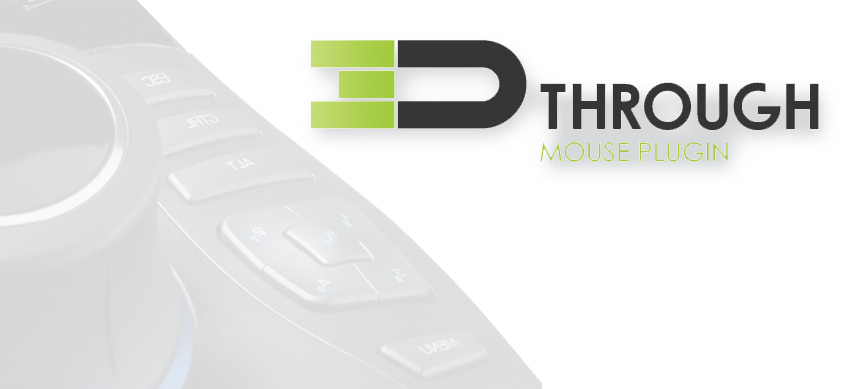

# 3D Through - 3DConnexion SpaceMouse Integration for Unity

[](https://opensource.org/licenses/Apache-2.0)
[](https://unity3d.com)
[](https://github.com/masterrey/3DThrough)

**Professional 3D mouse support for Unity Editor - Now Open Source!**



## Overview

3D Through is an open source Unity Editor plugin that provides seamless integration with 3DConnexion SpaceMouse devices. Navigate your scenes naturally with 6-degree-of-freedom (6DOF) input, manipulate GameObjects with precision, and access raw sensor data for custom implementations.

## ✨ Key Features

- 🎮 **Scene View Control** - Intuitive 6DOF camera navigation
- 🎯 **Object Manipulation** - Precise positioning and rotation
- 🔧 **Custom Scripting** - Raw sensor data API for your own tools
- ⚙️ **Adjustable Sensitivity** - Fine-tune to your preference
- 🔘 **Button Shortcuts** - Quick access to viewing modes
- 🔄 **Auto-Reconnect** - Robust connection management
- ↩️ **Undo Support** - Full Unity Undo system integration

## 🚀 Quick Start

1. **Install 3DConnexion drivers** from [3dconnexion.com](https://www.3dconnexion.com/service/drivers.html)
2. **Clone or download** this repository
3. **Copy** the `Assets/3DThrough` folder to your Unity project
4. **Open** Unity and go to `Tools > 3D Through`
5. **Start navigating** with your 3D mouse!

## 📋 System Requirements

- Unity Editor 2019.4 or later
- Windows OS (COM driver requirement)
- 3DConnexion compatible device
- 3DConnexion drivers installed

## 🎮 Supported Devices

- SpaceMouse Compact / Wireless / Pro / Enterprise
- Space Navigator
- Other 3DConnexion compatible devices

## 📖 Documentation

Complete documentation is available in the `Documentation` folder:

- **Full Manual** - Comprehensive guide with setup instructions
- **Script Reference** - API documentation with examples
- **Troubleshooting** - Solutions to common issues
- **Getting Started** - Quick start guide

## 💻 Usage Example

```csharp
using Mouse3D;

public class CustomController : MonoBehaviour 
{
    void Update() 
    {
        // Access raw 3D mouse data
        Vector3 movement = E3dThrough.BruteTranslation;
        Vector3 rotation = E3dThrough.BruteRotation;
        
        // Use in your custom implementation
        transform.position += movement * Time.deltaTime;
    }
}
```

## 🤝 Contributing

This project is now open source! Contributions are welcome:

1. Fork the repository
2. Create a feature branch (`git checkout -b feature/amazing-feature`)
3. Commit your changes (`git commit -m 'Add amazing feature'`)
4. Push to the branch (`git push origin feature/amazing-feature`)
5. Open a Pull Request

### Areas for Contribution

- macOS support
- Additional device compatibility
- UI improvements
- Documentation translations
- Bug fixes and optimizations

## 🐛 Reporting Issues

Found a bug? Have a feature request?

- **GitHub Issues:** https://github.com/masterrey/3DThrough/issues
- **Email:** masterrey@gmail.com

Please include:
- Unity version
- 3D mouse model
- Error messages
- Steps to reproduce

## 📦 Package Contents

```
3DThrough/
├── Assets/3DThrough/          # Main plugin folder
│   ├── Plugin/                # Core scripts and DLL
│   ├── Examples/              # Sample scripts
│   ├── Demo Scene/            # Example scene
│   └── Documentation/         # Guides and references
├── Documentation/             # Additional docs
├── CHANGELOG.md              # Version history
└── LICENSE                   # Apache 2.0 License
```

## 📄 License

Copyright 2024 masterrey

Licensed under the Apache License, Version 2.0.  
See the [LICENSE](LICENSE) file for details.

## 🙏 Acknowledgments

- Built for the Unity community
- Powered by 3DConnexion TDxInput SDK
- Thanks to all contributors and users!

## 📬 Contact

- **Email:** masterrey@gmail.com
- **GitHub:** https://github.com/masterrey/3DThrough

---

⭐ **If you find this plugin useful, please star the repository!**

Made with ❤️ for the Unity community
